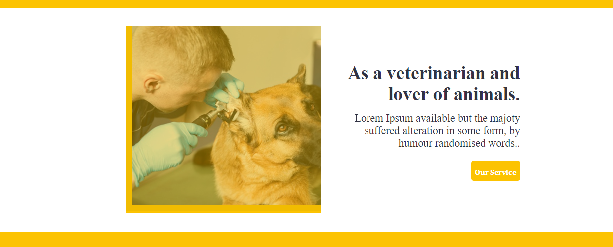
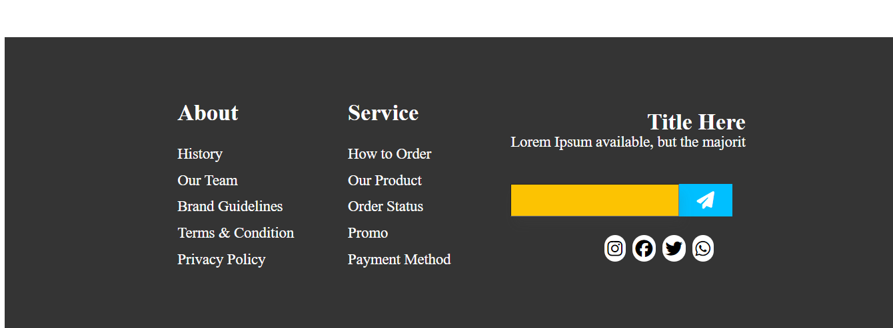

# Pagina web para veterinarias
Esta página web fue creada durante mis inicios en este mundo de la programación, en ella se puede visualizar todo el diseño necesario 
para que cualquier persona pueda dar conocer su compañía de veterinaria, además es muy fácil de personalizar ya que el único requisito 
que se necesita saber es html y css

## Capturas

 |   |
| :---: | :---: |
|  |   |

## Tecnologías utilizadas

